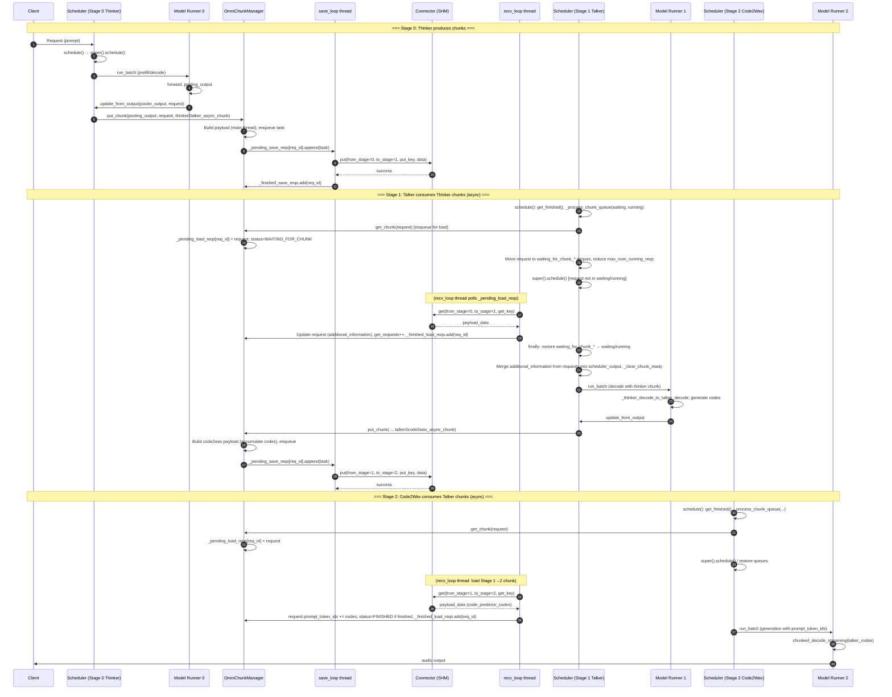

# Async Chunking

## Overview

The `async_chunk` feature enables asynchronous, chunked processing of data across multiple stages in a multi-stage pipeline (e.g., Qwen3-Omni with Thinker → Talker → Code2Wav stages). Instead of waiting for a complete stage output before forwarding to the next stage, this feature allows stages to process and forward data in chunks as it becomes available, significantly reducing latency and improving throughput.

With `async_chunk`:
- Stages can start processing as soon as chunks are available
- Overlapping execution across stages
- Reduced latency and improved throughput
- Better resource utilization
- Async scheduling: Chunk IO (get/put) overlaps with compute via background threads so the scheduler is not blocked waiting for chunks

## Performance
1. **Reduced Latency**: Next stage can start processing immediately
2. **Streaming Support**: Enables streaming for audio generation
3. **IO-Compute Overlap**: Chunk retrieval happens asynchronously while other requests compute
4. **Non-blocking Scheduler**: Requests waiting for chunks don't block the entire scheduler

| Scenario | Input Modality | Output Modality | async_chunk | Input tokens num | Output tokens num | Request num |  TTFT(ms) |  TTFP(ms) |
|--------|----------------------------|------------------------|-------------|-------------|-------------|------------------------|-------------|-------------|
|single request | text | text + audio | True | 10 | 10 | 1 | 89.90 | 831.18 |
|single request | text | text + audio | False | 10 | 10 | 1 | 98.19 | 3205.68 |
|single request | text | text + audio | True | 2500 | 900 | 1 | 380.03 | 1910.39 |
|single request | text | text + audio | False | 2500 | 900 | 1 | 392.15 | 11696 |

### Performance Data Comparison
<p align="center">
  <picture>
    <source media="(prefers-color-scheme: dark)" src="https://raw.githubusercontent.com/vllm-project/vllm-omni/refs/heads/main/docs/source/performance/qwen3-omni_performance.png">
    
  </picture>
</p>

## Architecture

### Components

1. **OmniConnector**: Inter-stage data transport only
   - Shared memory or other IPC mechanisms
   - **Transport-only API**: `put(from_stage, to_stage, put_key, data)` and `get(from_stage, to_stage, get_key)` (optionally with timeout)
   - No request-specific state; connector does not track put_requests, get_requests, or payload metadata
   - Chunk keys and request/chunk lifecycle are managed by OmniChunkManager

2. **Stage Input Processors**: Custom functions that process stage outputs into chunks for different models
Here is qwen3-omni showcase for reference:
   - `thinker2talker_async_chunk`: Processes thinker outputs for talker
   - `talker2code2wav_async_chunk`: Processes talker outputs for code2wav

3. **Schedulers**: Modified to handle chunk-based scheduling
   - `OmniARScheduler`: For autoregressive stages
   - `OmniGenerationScheduler`: For generation stages
   - Both schedulers use **OmniChunkManager** and **before/after** hooks around `super().schedule()`: process chunk queues before, restore queues and merge chunk data after

4. **OmniChunkManager**: Owns the full chunk lifecycle when async_chunk is enabled
   - **Chunk ID and key construction**: Builds keys like `{req_id}_{stage_id}_{chunk_id}` for put/get
   - **Assembling chunked business data**: Merges thinker embeddings (stage 0), accumulates code_predictor_codes and builds code2wav payloads (stage 1), etc.; uses connector-backed state (e.g. put_requests, get_requests, request_prompt_token_ids, code_prompt_token_ids) where needed
   - **Async get**: `get_chunk(request)` enqueues the request for loading; a background **recv_loop** thread polls the connector and, when data is available, updates the request (e.g. `additional_information`, `prompt_token_ids`) and marks it in `_finished_load_reqs`; scheduler calls `get_finished()` to learn which requests have chunks ready
   - **Async put**: `put_chunk(pooling_output, request, custom_process_input_func)` builds the payload in the main thread (to avoid races on request state), then enqueues a save task; a background **save_loop** thread performs `connector.put()`; payload processing and chunk accumulation (e.g. code2wav chunk_size) remain in the main thread
   - **State**: `_pending_load_reqs`, `_finished_load_reqs`, `_pending_save_reqs`, `_finished_save_reqs`; coordinates with scheduler so requests waiting for chunks are moved to WAITING_FOR_CHUNK and temporarily out of main queues

5. **Model Runners**: Handle chunk processing
   - `OmniGPUModelRunner`: Processes chunks in AR stages
   - `GPUGenerationModelRunner`: Processes chunks in generation stages

6. **Model Implementation**: Model-specific chunk handling
   - `Qwen3OmniMoeForConditionalGeneration`: Main model with async_chunk support
   - `chunked_decode_streaming`: Streaming audio generation

7. **Request status**: `RequestStatus.WAITING_FOR_CHUNK` is added via patch (e.g. in `vllm_omni/patch.py`) so requests waiting for a chunk are not scheduled by the base vLLM scheduler until the chunk is ready.

## Data Flow

### Sequential Flow
<p align="center">
  <picture>
    <source media="(prefers-color-scheme: dark)" src="https://raw.githubusercontent.com/vllm-project/vllm-omni/refs/heads/main/docs/source/architecture/qwen3-omni-non-async-chunk.png">
    
  </picture>
</p>

### Async Chunk Flow

<p align="center">
  <picture>
    <source media="(prefers-color-scheme: dark)" src="https://raw.githubusercontent.com/vllm-project/vllm-omni/refs/heads/main/docs/source/architecture/qwen3-omni-async-chunk.png">
    
  </picture>
</p>

### async chunk architecture
<p align="center">
  <picture>
    <source media="(prefers-color-scheme: dark)" src="https://raw.githubusercontent.com/vllm-project/vllm-omni/refs/heads/main/docs/source/architecture/async-chunk-architecture.png">
    
  </picture>
</p>

### Sequence Diagram



### Detailed Chunk Flow For Qwen3-Omni

1. **Thinker Stage (Stage 0)**:
   - Processes input and generates text tokens incrementally
   - After each decode step (or batch of steps), calls `chunk_manager.put_chunk()` (payload built in main thread, actual send in save_loop)
   - Chunk contains: `thinker_embeddings`, `thinker_hidden_states`, `thinker_sequences`, etc.
   - Uses `thinker2talker_async_chunk()` to format chunk data

2. **Talker Stage (Stage 1)**:
   - Receives chunks via `chunk_manager.get_chunk()` (enqueues for recv_loop); when ready, scheduler merges into request's `additional_information`
   - Processes each chunk as it arrives
   - For decode steps: Uses `_thinker_decode_to_talker_decode()` to project thinker embeddings
   - Generates codec codes incrementally
   - Sends chunks to Code2Wav via `chunk_manager.put_chunk()` using `talker2code2wav_async_chunk()`

3. **Code2Wav Stage (Stage 2)**:
   - Receives codec code chunks via OmniChunkManager (recv_loop updates `request.prompt_token_ids` and optionally `request.status` when finished)
   - Accumulates codes until chunk_size is reached (handled in talker's put_chunk path)
   - Uses `chunked_decode_streaming()` for streaming audio generation
   - Generates audio waveform incrementally

## Key Implementation Details

### Configuration

Enable async_chunk in stage configuration YAML:

```yaml
async_chunk: true
stage_args:
  - stage_id: 0
    engine_args:
      custom_process_next_stage_input_func: vllm_omni.model_executor.stage_input_processors.qwen3_omni.thinker2talker_async_chunk
  - stage_id: 1
    engine_args:
      custom_process_next_stage_input_func: vllm_omni.model_executor.stage_input_processors.qwen3_omni.talker2code2wav_async_chunk
```

### Connector and Chunk Manager Roles

- **Connector**: Performs only data transport (`put`/`get`). It does not track per-request chunk counters or payload metadata; those live on connector-backed state used by OmniChunkManager (or on the connector implementation if still required for key construction).
- **OmniChunkManager**: When async_chunk is enabled, it manages chunk keys, async get (enqueue → recv_loop → get_finished), async put (build payload in main thread → enqueue → save_loop), and uses per-request counters and accumulated data (e.g. put_requests, get_requests, request_prompt_token_ids, code_prompt_token_ids, finished_requests) where needed for key construction and payload assembly.

### Chunk Processing Functions in stage input processor

#### `thinker2talker_async_chunk()`

```python
def thinker2talker_async_chunk(
    pooling_output: dict[str, Any],
    request: OmniEngineCoreRequest,
) -> dict[str, Any]:
    """
    Processes thinker outputs to create talker inputs.
    Extracts:
    - thinker_embeddings (layer 0)
    - thinker_hidden_states (layer 24)
    - thinker_sequences (all token IDs)
    - thinker_input_ids (prompt token IDs)
    - TTS token embeddings (BOS/EOS/PAD)
    - finished flag
    """
```

#### `talker2code2wav_async_chunk()`

```python
def talker2code2wav_async_chunk(
    pooling_output: dict[str, Any],
    request: OmniEngineCoreRequest,
) -> dict[str, Any]:
    """
    Processes talker outputs to create code2wav inputs.
    Extracts code_predictor_codes and formats for code2wav.
    Returns empty list if no codes available.
    """
```

### Scheduler Modifications

#### `OmniARScheduler.schedule()`

- **Before `super().schedule()`** (when `chunk_manager` is set and stage_id ≠ 0):
  - `finished_load_chunk_reqs = chunk_manager.get_finished()`
  - `_process_chunk_queue(waiting, waiting_for_chunk_waiting_requests, WAITING)` and same for running: for each request, if not WAITING_FOR_CHUNK and not in `requests_with_ready_chunks` and not in connector `finished_requests`, call `chunk_manager.get_chunk(request)` and set status to WAITING_FOR_CHUNK; if already WAITING_FOR_CHUNK and in `finished_load_chunk_reqs`, set status back to WAITING/RUNNING and add to `requests_with_ready_chunks`; move requests that are now WAITING_FOR_CHUNK from main queue into `waiting_for_chunk_*` deques
  - Reduce `max_num_running_reqs` by the number of requests in `waiting_for_chunk_running_requests`
- **Call** `scheduler_output = super().schedule()`
- **In `finally`**: Restore requests from `waiting_for_chunk_*` back into `waiting` and `running`; clear `finished_load_chunk_reqs`
- **After**: Merge chunk data into scheduler_output (e.g. for `scheduled_cached_reqs`, set `additional_information[req_id]` from `self.requests[req_id].additional_information`); if `chunk_manager`, call `_clear_chunk_ready(scheduler_output)` to remove consumed reqs from `requests_with_ready_chunks`

#### `OmniARScheduler.update_from_output()`

- When chunk_manager is set, calls `chunk_manager.put_chunk(pooler_output, request, custom_process_next_stage_input_func)` (async: payload built here, send in save_loop)

#### `OmniGenerationScheduler.schedule()`

- **Before** the main scheduling loop (when `chunk_manager` is set): same pattern as AR—`get_finished()`, `_process_chunk_queue` for waiting and running, then reduce `max_num_running_reqs`
- Chunk retrieval for generation is driven by OmniChunkManager (recv_loop updates request `prompt_token_ids` and status); no blocking `get_chunk_for_generation()` in the hot path
- **After** building scheduler_output (or after `super().schedule()` in fallback): `_restore_chunk_requests()` and `_clear_chunk_ready(scheduler_output)`

### Async Scheduling for Chunk IO Overlap

The async scheduling feature overlaps chunk IO operations with compute to improve throughput:

#### Request State Transitions

1. **WAITING/RUNNING → WAITING_FOR_CHUNK**:
   - In `_process_chunk_queue`, when a request needs a chunk, `chunk_manager.get_chunk(request)` is called (enqueues for recv_loop)
   - Request status set to WAITING_FOR_CHUNK and request is moved from main waiting/running queues into `waiting_for_chunk_waiting_requests` / `waiting_for_chunk_running_requests`
   - Base vLLM scheduler does not see these requests, so it does not schedule them
   - This prevents blocking while chunk retrieval happens in the background

2. **WAITING_FOR_CHUNK → WAITING/RUNNING**:
   - When recv_loop has loaded the chunk, the request is in `chunk_manager.get_finished()`
   - Scheduler restores those requests to WAITING or RUNNING and adds them back to `waiting` / `running` in the `finally` block after `super().schedule()`
   - Next schedule cycle they are eligible again; `_clear_chunk_ready` removes them from `requests_with_ready_chunks` once they have been scheduled and consumed

#### OmniChunkManager

- **recv_loop**: Background thread; iterates over `_pending_load_reqs`, calls `connector.get(...)` (non-blocking/timeout), on success updates request and connector state, moves req to `_finished_load_reqs` and removes from `_pending_load_reqs`
- **save_loop**: Background thread; dequeues tasks from `_pending_save_reqs`, calls `connector.put(...)`; on success marks request in `_finished_save_reqs`
- **get_chunk(request)**: Enqueues request for load (adds to `_pending_load_reqs`)
- **get_finished()**: Returns and clears the set of request IDs that have finished loading a chunk
- **put_chunk(...)**: Builds payload (including optional merging/accumulation) in main thread, increments put_requests, enqueues save task into `_pending_save_reqs`

#### Benefits

- **Non-blocking**: Other requests can continue processing while chunks are being fetched
- **Better GPU Utilization**: Reduces idle time when waiting for chunk IO
- **Improved Throughput**: Overlaps IO operations with compute operations
- **Lower Latency**: Requests don't block the entire scheduler while waiting for chunks

### Model Runner Modifications

#### `OmniGPUModelRunner._preprocess()`

- When `async_chunk` is enabled, uses `_get_additional_information()` to retrieve chunk data from scheduler
- Falls back to request state for non-async_chunk mode
- Handles per-request additional information for prefill and decode

#### `OmniGPUModelRunner._process_additional_information_updates()`

- Processes model-provided updates and merges into request state
- Handles async_chunk vs non-async_chunk paths differently

### Model-Specific Handling

#### Thinker → Talker Transition

In `talker_preprocess_decode()`:
```python
if self.vllm_config.model_config.async_chunk:
    # Direct projection from thinker embeddings
    text_step = self._thinker_decode_to_talker_decode(info_dict, device, update_dict)
else:
    # Use trailing_text_hidden queue
    text_step = self._get_from_trailing_queue(info_dict)
```

#### Talker → Code2Wav Transition

In `generate_audio()`:
```python
if self.vllm_config.model_config.async_chunk:
    # Streaming decode with smaller chunks
    audio_tensor = self.code2wav.chunked_decode_streaming(
        talker_codes, chunk_size=25, left_context_size=25
    )
else:
    # Standard chunked decode
    audio_tensor = self.code2wav.chunked_decode(
        talker_codes, chunk_size=300, left_context_size=25
    )
```

### Chunk Accumulation Logic

For Talker → Code2Wav:
- Codes are accumulated in connector-backed state (e.g. `code_prompt_token_ids[req_id]`) during `put_chunk` in the main thread
- Chunk is enqueued for send when `length % chunk_size == 0` or `finished=True`
- Context window: `left_context_size + chunk_length`
- Codes are reshaped: `[num_quantizers, seq_len] → [seq_len * num_quantizers]`

## Request Lifecycle

1. **Request Initiation**:
   - Request submitted to Stage 0 (Thinker)
   - Connector/chunk-manager state for the request is initialized (e.g. put_requests, get_requests) when first used

2. **Chunk Generation (Stage 0)**:
   - After each decode step, `chunk_manager.put_chunk()` is called
   - Payload built in main thread; chunk key: `f"{req_id}_{stage_id}_{chunk_id}"`
   - Save task enqueued; save_loop performs `connector.put()` asynchronously
   - put_requests incremented when committing to send

3. **Chunk Consumption (Stage 1+)** - With Async Scheduling:
   - At schedule start, scheduler gets `chunk_manager.get_finished()` and runs `_process_chunk_queue`
   - Requests that need a chunk: `chunk_manager.get_chunk(request)` enqueues them; status → WAITING_FOR_CHUNK; moved to waiting_for_chunk_* queues
   - recv_loop in background polls connector; when chunk arrives, updates request (e.g. additional_information, prompt_token_ids) and adds to get_finished()
   - After super().schedule(), scheduler restores waiting_for_chunk_* requests back to waiting/running
   - Chunk data is already on the request (e.g. additional_information); scheduler_output cached_reqs get additional_information from requests; _clear_chunk_ready clears consumed entries from requests_with_ready_chunks

4. **Chunk Processing**:
   - Model runner processes chunk in `_preprocess()`
   - Model forward pass generates output
   - Output chunk sent to next stage via `chunk_manager.put_chunk()` (async: enqueue, save_loop sends)

5. **Request Completion**:
   - When `finished=True` in chunk, request marked as finished
   - Final chunks processed
   - Resources cleaned up
   - Request removed from chunk manager tracking

## Synchronization and Ordering

- **Chunk Ordering**: Chunks are sequenced via chunk_id counter (e.g. put_requests/get_requests)
- **Request Isolation**: Each request has independent chunk counters and queues
- **Completion Detection**: `finished` flag in chunk indicates completion
- **State Synchronization**: OmniChunkManager recv_loop/save_loop use locks; scheduler only reads get_finished() and enqueues get_chunk/put_chunk
- **Queue Coordination**: Temporary queues (waiting_for_chunk_waiting_requests, waiting_for_chunk_running_requests) keep requests out of base scheduler until chunk is ready, then restore

## Configuration Parameters

### Stage Configuration

- `async_chunk: bool`: Enable/disable async chunk mode
- `custom_process_next_stage_input_func: str`: Path to chunk processing function
- `stage_connector_config: dict`: Connector configuration

### Chunk Sizes

- **Thinker → Talker**: Per decode step (typically 1 token)
- **Talker → Code2Wav**: Accumulated to chunk_size before sending
- **Code2Wav**: Streaming decode with chunk_size

### Connector Configuration

```yaml
connectors:
  - from_stage: 0
    to_stage: 1
    spec:
      name: SharedMemoryConnector
      extra:
        stage_id: 0
```


## Related Files

- `vllm_omni/model_executor/stage_input_processors/qwen3_omni.py`: Chunk processing functions
- `vllm_omni/distributed/omni_connectors/omni_chunk_manager.py`: OmniChunkManager (async get/put, recv_loop, save_loop) and connector usage
- `vllm_omni/core/sched/omni_ar_scheduler.py`: AR scheduler with chunk_manager, _process_chunk_queue, restore, _clear_chunk_ready
- `vllm_omni/core/sched/omni_generation_scheduler.py`: Generation scheduler with same async chunk pattern
- `vllm_omni/worker/gpu_model_runner.py`: Model runner with chunk handling
- `vllm_omni/model_executor/models/qwen3_omni/qwen3_omni.py`: Model implementation
- `vllm_omni/engine/arg_utils.py`: Configuration definitions
- `vllm_omni/config/model.py`: Model config with async_chunk field
- `vllm_omni/patch.py`: Patches (e.g. RequestStatus.WAITING_FOR_CHUNK) for async chunk support
